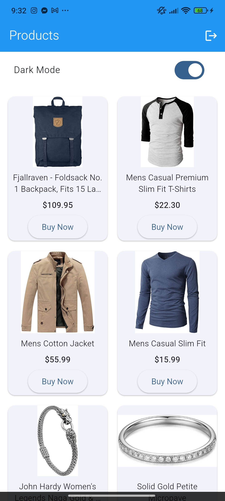
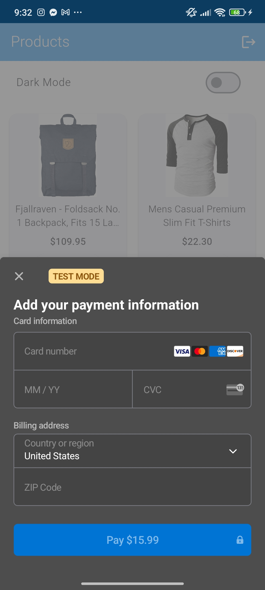

# 🛍️ Simple E-Commerce App (Flutter + Firebase + Stripe + GetX)

A minimal Flutter-based e-commerce application built with clean architecture using GetX.  
Supports Firebase Google and Facebook login, Stripe payment integration, API-based product listing, and dynamic theme switching.

---

## 🚀 Features Implemented

- 🔐 Google Sign-In with Firebase
- 🔵 Facebook Login with Firebase
- 🛒 Product listing from [FakeStoreAPI](https://fakestoreapi.com/products)
- 💳 Stripe Payment Integration (Payment Sheet)
- 🌗 Light & Dark mode toggle with theme persistence
- 🧼 Clean folder structure following GetX architecture
- 🔄 Easy loading feedback and dialog prompts

---

## 📦 Packages Used

| Package                  | Purpose                            |
|--------------------------|------------------------------------|
| `get`                    | State management & routing         |
| `firebase_auth`          | Firebase authentication            |
| `google_sign_in`         | Google login                       |
| `flutter_facebook_auth`  | Facebook login                     |
| `flutter_easyloading`    | Loading indicators & toast         |
| `flutter_stripe`         | Stripe PaymentSheet integration    |
| `http` or `dio`          | API requests                       |
| `get_storage`            | Persistent theme settings          |
| `firebase_core`          | Firebase core setup                |

---

## ⚙️ Setup Instructions

### 🔧 Prerequisites

- Flutter SDK (latest stable)
- Firebase project with Google sign-in enabled
- Stripe account with test keys
- Android/iOS device or emulator

### 🧭 Steps

1. **Clone the repo**
   ```bash
   git clone https://github.com/killgrave000/ecommerce_app.git
   cd ecommerce_app


## 📸 Screenshots

### 🔐 Login Screen


### 🛒 Product Grid



### 💳 Stripe Payment Sheet


